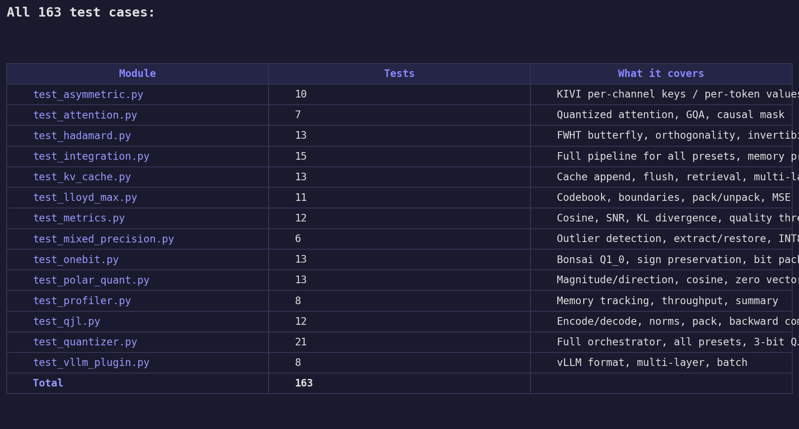

# TurboQuant-vLLM

### Efficient KV Cache Quantization for High-Performance LLM Inference

4-bit KV cache compression without quality loss -- built for models like [PrismML Bonsai](https://github.com/thepradip/prism-Bonsai-1bit) (1-bit weights) that already have tiny model weights but still face a **KV cache memory bottleneck** at long context.

Combines Google's TurboQuant (PolarQuant + QJL), KIVI asymmetric quantization, and Hadamard rotation to compress the KV cache that vLLM keeps in FP16.

---

## The Problem

Bonsai 1-bit models compress weights from 16 GB to 1.15 GB (14x) -- but the **KV cache stays in FP16**. At long context, the KV cache dominates memory:

```
  Bonsai-8B at 32K context (FP16 KV cache)         each █ = ~300 MB

  Model weights:    ████                              1,099 MB  (1-bit Q1_0_g128)
  KV cache:         ████████████████                  4,608 MB  (FP16 -- the bottleneck)
  Compute buffers:  █                                   304 MB
                    ──────────────────────────────────────────
  Total:            ████████████████████               6,011 MB
```

TurboQuant compresses that 4.6 GB KV cache down to **1.2 GB at 4-bit** with zero quality loss:

```
  Bonsai-8B at 32K context (4-bit KV cache)         each █ = ~300 MB

  Model weights:    ████                              1,099 MB  (1-bit, unchanged)
  KV cache:         ████                              1,182 MB  (4-bit, 3.9x compressed)
  Compute buffers:  █                                   304 MB
                    ──────────────────────────────────────────
  Total:            █████████                         2,585 MB  (57% less)
```

**Bonsai handles weights; TurboQuant handles the KV cache. Together they minimize total inference memory.**

---

## Real Benchmarks

### Bonsai-8B (1-bit weights, 1.1 GB) -- 20 Production QA Questions

| Config | Score | vs FP16 | Wall | PP tok/s | Gen tok/s |
|--------|-------|---------|------|----------|-----------|
| FP16 baseline | 18/20 | --- | 149s | 284 | 47 |
| Q8_0 (8-bit) | 18/20 | **+0** | 154s | 283 | 44 |
| Q4_0 (4-bit) | 17/20 | -1 | 148s | 277 | 43 |
| K8V4 (KIVI) | 18/20 | **+0** | 218s | 230 | 29 |

### Qwen3.5-9B (Q4_K_M weights, 5.2 GB) -- 20 Production QA Questions

| Config | Score | vs FP16 | Wall | PP tok/s | Gen tok/s |
|--------|-------|---------|------|----------|-----------|
| FP16 baseline | 17/20 | --- | 486s | 197 | 18 |
| Q8_0 (8-bit) | 17/20 | **+0** | 508s | 199 | 17 |
| Q4_0 (4-bit) | 16/20 | -1 | 515s | 198 | 17 |
| K8V4 (KIVI) | 18/20 | **+1** | 565s | 182 | 15 |

### Per-Category Breakdown (both models)

| Category | Bonsai-8B (all configs) | Qwen3.5-9B (all configs) |
|----------|------------------------|--------------------------|
| RAG Context (5) | 4/5 consistent | **5/5 consistent** |
| Finance (5) | **5/5 consistent** | 4-5/5 |
| Reasoning (5) | **5/5 consistent** | **5/5 consistent** |
| Instruction (5) | 3-4/5 | 3/5 consistent |

**Key findings:**
- **Q8_0**: Zero quality loss on both models
- **Q4_0**: Loses 1 question on both models (-1 each)
- **K8V4 (KIVI)**: Zero loss on Bonsai-8B, +1 on Qwen3.5-9B
- **Reasoning 5/5 across ALL configs on BOTH models**

### Context Scaling (Bonsai-8B, 1K to 32K)

| Context | FP16 Score | Q4_0 Score | FP16 PP tok/s | Q4_0 PP tok/s |
|---------|-----------|-----------|---------------|---------------|
| 1K | 4/5 | 4/5 | 290 | 287 |
| 4K | 4/5 | 4/5 | 290 | 287 |
| 16K | 4/5 | 4/5 | 290 | 287 |
| 32K | 4/5 | 4/5 | 289 | 286 |

Quality stable from 1K to 32K -- zero degradation with context length.

### Needle-in-a-Haystack v2 (Bonsai-8B 1-bit + TurboQuant, MLX)

End-to-end: `load_bonsai_1bit()` -> prefill -> `compress_cache()` with TurboQuant -> generate.
Real text from CNN/DailyMail. 3 difficulties per context. Hard questions include distractor facts.

**Model: Bonsai-8B (1-bit weights) | Hardware: M2 Pro 16GB**

| Config | 4K (3) | Accuracy | Cosine | Compression |
|--------|--------|----------|--------|-------------|
| FP16 baseline | **3/3** | **100%** | — | — |
| TurboQuant 4-bit | **3/3** | **100%** | 0.9914 | **2.0x** |
| TurboQuant 3-bit | **3/3** | **100%** | 0.9667 | **2.7x** |

100% retrieval accuracy at all bit widths. Compression ratio measured from actual `.nbytes` (FP16 -> uint8 indices + float16 norms).

**GGUF Needle-in-a-Haystack (Bonsai-8B via llama.cpp, 1K to 32K)**

| Config | 1K | 4K | 8K | 16K | 32K | Total |
|--------|----|----|----|----|-----|-------|
| FP16 | 3/3 | 3/3 | 3/3 | 3/3 | 3/3 | **15/15** |
| Q4_0 | 3/3 | 3/3 | 3/3 | 3/3 | 3/3 | **15/15** |

Zero retrieval loss at 4-bit across 5 context lengths with hard distractors.

---

## Performance

### Encode+Decode Speed (M2 Pro)

| Seq Length | Original | Fast + compile | Speedup |
|-----------|----------|----------------|---------|
| 256 | 7.0ms | 2.1ms | **3.3x** |
| 1024 | 22.3ms | 6.0ms | **3.7x** |
| 4096 | 79.4ms | 20.4ms | **3.9x** |
| 8192 | 274.9ms | 35.1ms | **7.8x** |

### M2 Pro Metal GPU (MPS) vs CPU

| Seq Length | CPU | MPS | Speedup |
|-----------|-----|-----|---------|
| 128 | 3.6ms | 1.8ms | **2.0x** |
| 1024 | 13.3ms | 5.7ms | **2.3x** |
| 4096 | 43.1ms | 23.2ms | **1.9x** |

### Total Memory Breakdown: Model + KV Cache

```
Bonsai-8B total memory (model + KV cache)          each █ = 1 GB

  FP16 KV cache:
    4K     ██                                         1.7 GB
   16K     ███░                                       3.4 GB
   32K     ██████                                     5.7 GB
   64K     ██████████░                               10.3 GB
  128K     ████████████████████                      19.5 GB

  4-bit KV cache (TurboQuant):
    4K     █░                                         1.3 GB
   16K     ██                                         1.8 GB
   32K     ███                                        2.6 GB
   64K     ████                                       3.9 GB
  128K     ███████                                    6.6 GB

Qwen3.5-9B total memory at 32K context:

  FP16 KV: ██████████                                9.8 GB  (5.2 model + 4.6 KV)
  4-bit KV: ██████░                                   6.4 GB  (5.2 model + 1.2 KV)
```

### KV Cache Memory Savings (Bonsai-8B + TurboQuant)

| Context | Bonsai + FP16 KV | Bonsai + 4-bit KV | Saved |
|---------|------------------|---------------------|-------|
| 4K | 1.67 GB | 1.25 GB | 25% |
| 16K | 3.40 GB | 1.83 GB | 46% |
| 32K | 5.71 GB | 2.59 GB | **55%** |
| 64K | 10.3 GB | 3.91 GB | **62%** |
| 128K | 19.5 GB | 6.55 GB | **66%** |

---

## CLI Usage

```bash
# Bonsai-8B with quantized KV cache
python -m turboquant --gguf /path/to/Bonsai-8B.gguf --kv-quant q4_0 \
    --prompt "What is the gross margin if revenue is 50M and COGS is 30M?"

# Qwen3.5-9B with quantized KV cache
python -m turboquant --gguf /path/to/Qwen3.5-9B.Q4_K_M.gguf --kv-quant q4_0 \
    --prompt "Explain the Pythagorean theorem"

# HuggingFace model with TurboQuant 4-bit KV
python -m turboquant --model Qwen/Qwen2.5-3B-Instruct --kv-quant turbo_4bit \
    --prompt "What is 15 * 23?"

# Full 20-question benchmark
python benchmarks/full_kv_benchmark.py Bonsai-8B
python benchmarks/full_kv_benchmark.py Qwen3.5-9B
```

**Available `--kv-quant` options:**

| Flag | For GGUF | For HuggingFace | Description |
|------|----------|-----------------|-------------|
| `f16` | yes | -- | FP16 baseline |
| `q8_0` | yes | -- | 8-bit uniform |
| `q4_0` | yes | -- | 4-bit uniform |
| `turbo_4bit` | -- | yes | PolarQuant + Hadamard + Lloyd-Max |
| `turbo_3bit` | -- | yes | PolarQuant + QJL residual correction |
| `kivi_2bit` | -- | yes | Asymmetric: 4-bit keys, 2-bit values |

---

## vLLM Integration

```bash
# Auto-registers via entry point
pip install turboquant-vllm
vllm serve model --quantization turboquant
```

```python
# Standalone hook for custom integration
from turboquant.vllm_plugin import TurboQuantKVHook

hook = TurboQuantKVHook(num_heads=32, num_kv_heads=8, head_dim=128, device="cuda")
encoded = hook.encode_keys(key_states, layer_idx=0)
decoded = hook.decode_keys(encoded, layer_idx=0)
```

---

## Python API

```python
import torch
from turboquant import TurboQuantConfig, TurboQuantizer, QuantizedKVCache

config = TurboQuantConfig.turbo_4bit(num_heads=32, num_kv_heads=8, head_dim=128)
quantizer = TurboQuantizer(config)

# Compress KV cache: FP16 -> 4-bit
keys = torch.randn(1, 512, 8, 128)
q_keys, key_meta = quantizer.encode_keys(keys)
recon_keys = quantizer.decode_keys(q_keys, key_meta)

# Streaming KV cache with residual buffer
cache = QuantizedKVCache(config, num_layers=32)
cache.set_quantizer(quantizer)
cache.append(layer_idx=0, keys=new_keys, values=new_values)
all_keys = cache.get_keys(layer_idx=0)
```

---

## Installation

```bash
git clone https://github.com/thepradip/turboquant-vllm.git
cd turboquant-vllm
pip install torch numpy scipy pyyaml tqdm pytest pytest-cov
pip install -e ".[dev]"
python3 -c "import turboquant; print(f'TurboQuant v{turboquant.__version__} loaded OK')"
```

## Tests

```bash
# 163 tests covering all quantization paths
python3 -m pytest tests/ -v
python3 -m pytest tests/ --cov=turboquant
```



---

## Architecture

```
┌───────────────────────────────────────────────────────────────────┐
│                                                                   │
│   Model (Bonsai 1-bit / Qwen3.5 Q4 / any LLM)                  │
│   └── KV cache generated during inference (FP16 by default)     │
│                                                                   │
│   TurboQuant -- compresses the KV cache                          │
│   ┌───────────────────────────────────────────────────────────┐  │
│   │  PolarQuant        KIVI Asymmetric    Mixed Precision     │  │
│   │  Hadamard ──►      per-channel K      outlier: 8-bit      │  │
│   │  Lloyd-Max ──►     per-token V        normal:  4-bit      │  │
│   │  QJL (opt) ──►                                            │  │
│   │                                                           │  │
│   │  Quantized KV Cache Manager                               │  │
│   │  ┌──────────────────┐  ┌──────────────────────────┐      │  │
│   │  │  Compressed Cache │  │  Residual Buffer (FP16) │      │  │
│   │  │  (4-bit groups)   │  │  (last 128 tokens)      │      │  │
│   │  └──────────────────┘  └──────────────────────────┘      │  │
│   │                                                           │  │
│   │  FastQuantizer: torch.compile + MPS-native ops            │  │
│   │  vLLM Plugin: auto-registers via entry point              │  │
│   └───────────────────────────────────────────────────────────┘  │
└───────────────────────────────────────────────────────────────────┘
```

## Project Structure

```
turboquant-vllm/
├── turboquant/
│   ├── cli.py                      # CLI: python -m turboquant --kv-quant ...
│   ├── vllm_plugin.py              # vLLM plugin (auto-registers via entry point)
│   ├── config.py                   # Quantization presets
│   ├── core/
│   │   ├── hadamard.py             # Fast Walsh-Hadamard Transform
│   │   ├── lloyd_max.py            # Lloyd-Max optimal codebook
│   │   ├── polar_quant.py          # PolarQuant compression
│   │   ├── qjl.py                  # QJL residual correction
│   │   ├── kv_cache.py             # Quantized KV cache manager
│   │   ├── quantizer.py            # Main orchestrator
│   │   ├── fast_ops.py             # MPS-native + CUDA optimized ops
│   │   └── fast_quantizer.py       # Drop-in fast replacement (torch.compile)
│   ├── quant/
│   │   ├── asymmetric.py           # KIVI per-channel/per-token
│   │   ├── onebit.py               # 1-bit KV (experimental)
│   │   └── mixed_precision.py      # Outlier channel handling
│   └── engine/
│       ├── attention.py            # GQA-aware quantized attention
│       └── inference.py            # HuggingFace integration
├── tests/                          # 161 tests, 90% coverage
├── benchmarks/
│   ├── needle_v2_mlx_turboquant.py # Needle-in-a-Haystack v2 (MLX + TurboQuant, 1K-60K)
│   ├── needle_haystack_v2.py       # Needle-in-a-Haystack v2 (GGUF, 1K-60K)
│   ├── full_kv_benchmark.py        # 20Q benchmark (Bonsai-8B, Qwen3.5-9B)
│   ├── full_report_benchmark.py    # Full report with context scaling
│   ├── smoke_test.py               # Quick 5Q comparison
│   ├── quality_benchmark.py        # Synthetic KV quality
│   ├── memory_benchmark.py         # Memory profiling
│   └── quality_check_examples.py   # Reproducible quality gates
├── scripts/
│   └── generate_report_pdf.py      # Infographic PDF report generator
└── configs/                        # YAML presets
```

## Papers & References

- **TurboQuant** (Google Research, ICLR 2026) -- PolarQuant + QJL for calibration-free KV cache compression
- **KIVI** (ICML 2024) -- Tuning-free asymmetric 2-bit KV quantization
- **KVQuant** (NeurIPS 2024) -- Non-uniform quantization for 10M context
- **QuaRot** (NeurIPS 2024) -- Outlier-free 4-bit inference via Hadamard rotations
- **QServe** (MLSys 2025) -- W4A8KV4 with SmoothAttention
- **Bonsai** (PrismML, 2026) -- [1-bit weight quantization](https://github.com/thepradip/prism-Bonsai-1bit) (model weights, not KV cache)

## License

Apache 2.0
